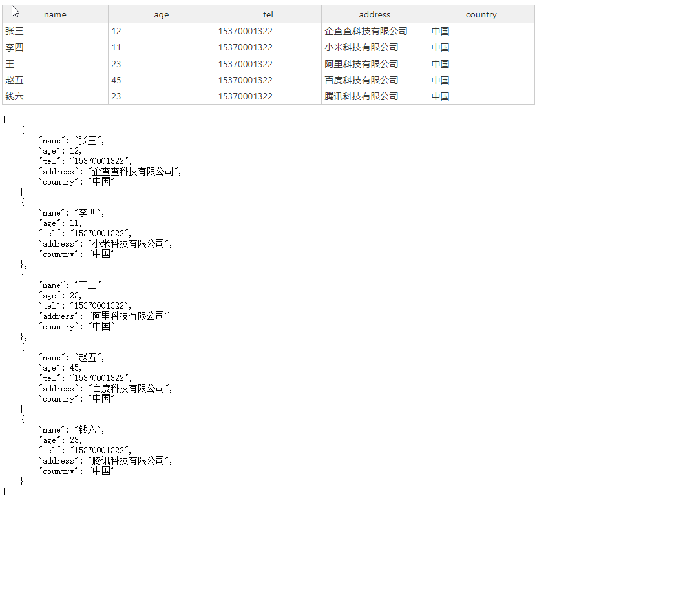

# qcc-json-table

# 介绍
  表格实时在线编辑插件，支持部分excel操作。


# 样例



# 开始

```javascript
npm install qcc-json-table --save
```

# 使用
```javascript
import VueJsonTable from 'qcc-json-table';
Vue.use(VueJsonTable)
```


# 快捷键说明

  |  key    | 说明  | 
  |  ----   | ----  |
  | 方向键    | 向上、向下、向左或向右移动一个单元格 |
  | Ctrl+↑   | 移动到当前列的第一个单元格 |
  | Ctrl+↓  | 移动到当前列的最后一个单元格 |
  | Ctrl+←  | 移动到当前行最左边的单元格 |
  | Ctrl+→  | 移动到当前列的最后一个单元格 |
  | F2  | 进入活动单元格的编辑模式 |
  | 字母数字键  | 移动到当前列的最后一个单元格 |
  | Tab  | 移动到下一个单元格*（如果只有一列可用，则向下移动一个单元格） |
  | Shift+Tab  | 移动到上一个单元格*（如果只有一列可用，则向上移动一个单元格） |
  | Home  | 移动到当前行的第一个非冻结单元格 |
  | Ctrl+Home  | 移动到网格的第一个非冻结单元格 |
  | End | 移动到当前行的最后一个非冻结单元格 |
  | Ctrl+End  | 移动到网格的最后一个非冻结单元格 |
  | Page Up  | 向上移动一个屏幕 |
  | Page Down  | 向下移动一个屏幕 |
  | Ctrl+A  | 选择所有单元格和标题 |
  | Ctrl+ Shift+↑  | 将选择范围扩展到当前列的第一个单元格 |
  | Ctrl+ Shift+↓  | 将选择范围扩展到当前列的最后一个单元格 |
  | Ctrl+ Shift+←  | 将选择范围扩展到当前行最左边的单元格 |
  | Ctrl+ Shift+→ | 将选择范围扩展到当前行最右边的单元格 |
  | Shift+ 方向键  | 将所选内容扩展一个单元格 |
  | Shift+Home  | 将选择范围扩展到当前行的第一个非冻结单元格 |
  | Shift+End  | 将选择范围扩展到当前行的最后一个非冻结单元格 |
  | Delete	   | 清除所选单元格的内容 |
  | Ctrl+X	   | 将选中单元格的内容剪切到系统剪贴板 |
  | Ctrl+C	   | 将所选单元格的内容复制到系统剪贴板	 |
  | Ctrl+V	   | 从系统剪贴板粘贴 |
  | Ctrl+Z	   | 撤消上一个操作 |
  | Ctrl+Y	   | 重做上一个动作 |

# 参数说明
  |  名称   | 是否必填  | 类型  |默认值| 说明        |
  |  ----   |  ----   | ----  | ----  | ----      |
  | jsonData|    是   |  Array | [] |  json数组   |
  | width|    否   |  Number/String | 100% |  表格宽度(支持百分比)   |
  | height|    否   |  Number/String |  auto   |表格高度(不支持百分比) |
  | colWidths|    否   |  Array/String/Number | 100 |  列宽 (为每列设置相同的宽度) |
  | showRowsNum|    否   |  Boolean | false|  显示行号   |
  | fixColumnIndex|    否   |  Number | 0 | 列固定索引位置   |
  | stretchH|    否   |  String | 'all' ('last'， 'none') |  拉伸列使网格适合容器   |
  | multiColumnSorting|    否   | Boolean| true |  是否允许列排序   |
  | manualColumnResize|    否   | Boolean|  true |  是否允许手动调整列宽   |
  | className|    否   | String|  "" |  自定义cell样式   |
  | showTitle|    否   | Boolean|  false |  是否显示cell title   |
  | highlights|    否   | Array|  [] |  高亮列头   |
  | repeatHighlightsCell|    否   | Array|  [] |  高亮列重复值   |
  | cellClickFlag|    否   | Boolean|  false |  是否启动单元格点击回调   |
  


# 事件说明
  |  名称           | 说明      | 返回参数                                 |
  |  ----           | ----      | ----                                    |
  |  removeColumn   | 删除列     | 返回删除得列名                           |
  |  updateColumn   | 更新列名   | 返回更新前，后 列名                       |
  |  addColumn      | 新增列     | 返回新增得列明                           |
  |  cellClick      |单元格点击  |返回单元格索引（row， col）位置以及单元格内容|


# 样例
```html
 <VueJsonTable
    :jsonData="[...data]"
    v-model="data"
    :width="width"
    :height="height"
    :colWidths="colWidths"
    :stretchH="stretchH"
    :multiColumnSorting="multiColumnSorting"
    :fixColumnIndex="fixColumnIndex"
    :manualColumnResize="manualColumnResize"
    @removeColumn="removeColumn"
    @updateColumn="updateColumn"
    @addColumn="addColumn"
    ></VueJsonTable>
  ```